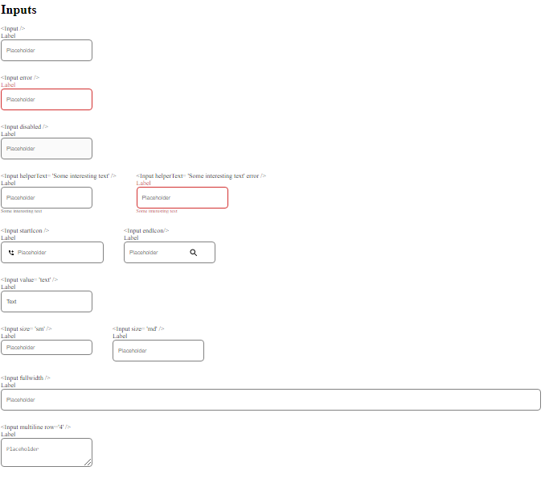

<!-- Please update value in the {}  -->

<h1 align="center">{Your project name}</h1>

  <h3>
    <a href="https://github.com/Tsikitsiky/input-component">
      Demo
    </a>
     | 
    <a href="https://zealous-hawking-b3f4cf.netlify.app/">
      Solution
    </a>
  </h3>

<!-- TABLE OF CONTENTS -->

## Table of Contents

-   [Overview](#overview)
    -   [Built With](#built-with)
-   [Features](#features)
-   [How to use](#how-to-use)
-   [Contact](#contact)
-   [Acknowledgements](#acknowledgements)

<!-- OVERVIEW -->

## Overview

-   My demo can be seen in <a href="https://github.com/Tsikitsiky/input-component">Demo</a>
-   In this project, I experienced deploying a repository and dealing with lots of conditions

### Built With

<!-- This section should list any major frameworks that you built your project using. Here are a few examples.-->

-   [React](https://reactjs.org/)

## Features

<!-- List the features of your application or follow the template. Don't share the figma file here :) -->

## How To Use

<!-- Example:  -->

To use an input you have to specify the type of the input, the label and everything you want to include.

 The user is allowed to use an icon at the beginning or at the end.
 
 User can set an input as disabled by setting the disabled attribute.
 
 User can choose between input and textarea.

 User can choose colors and sizes.

 User can choose to have a helper text.

## Acknowledgements

<!-- This section should list any articles or add-ons/plugins that helps you to complete the project. This is optional but it will help you in the future. For exmpale -->

## Contact

-   Website [your-website.com](https://{your-web-site-link})
-   GitHub [@Tsikitsiky](https://{github.com/Tsikitsiky})
-   Twitter [@your-twitter](https://{twitter.com/your-username})
